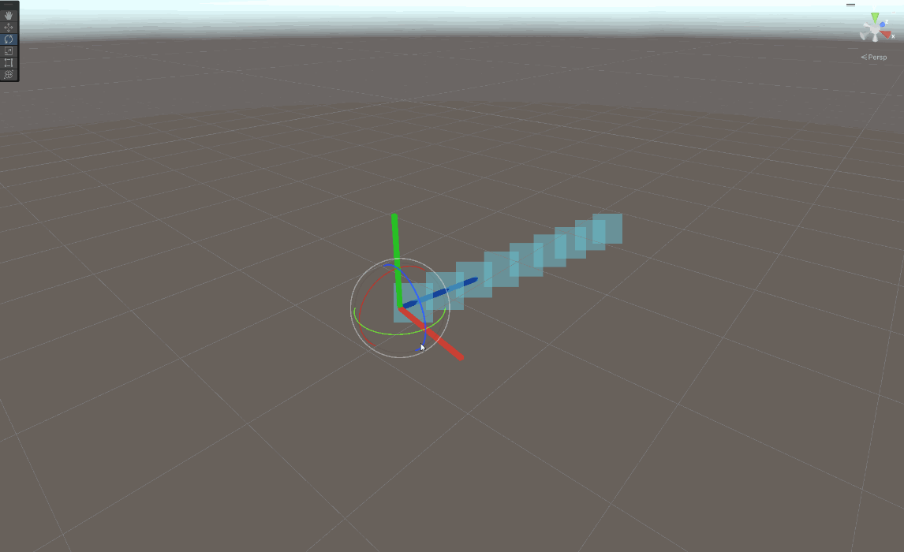
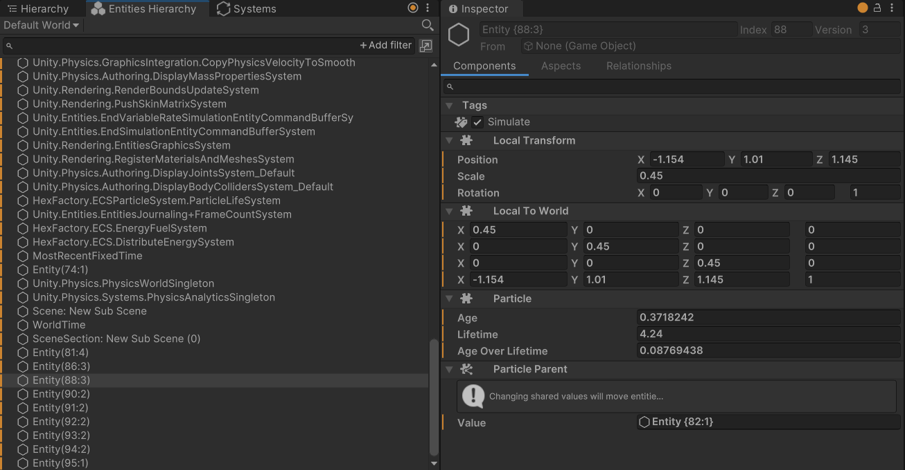
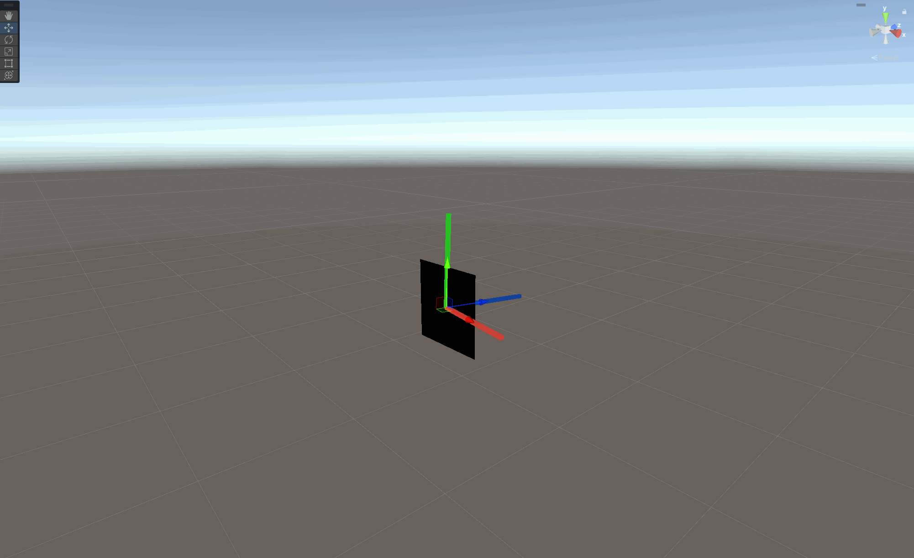
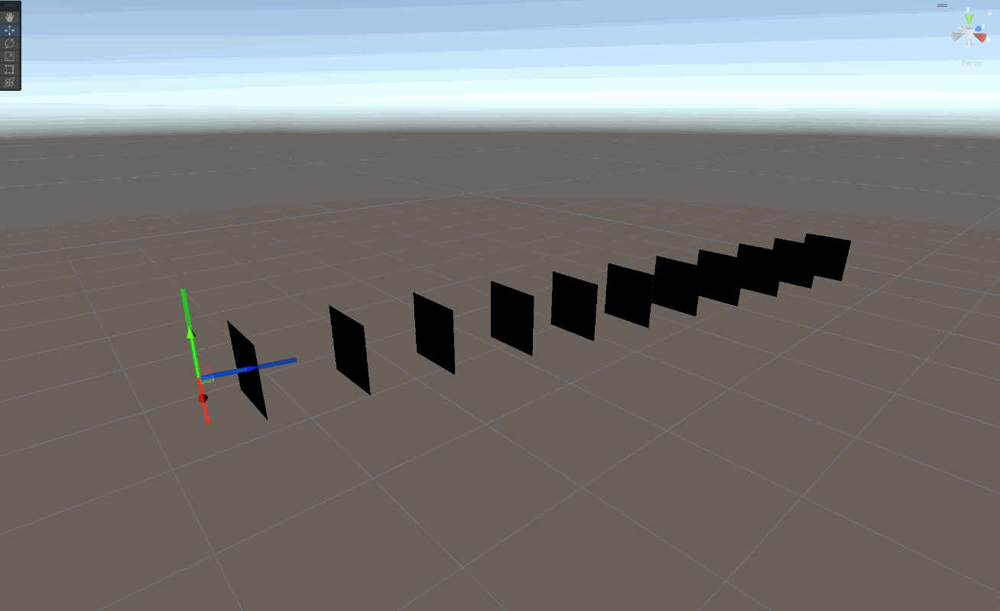
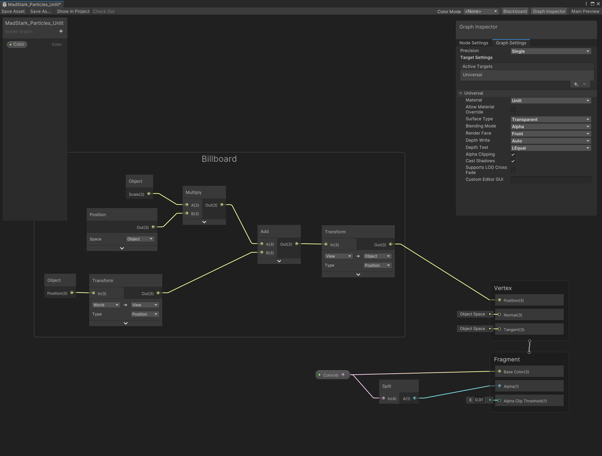
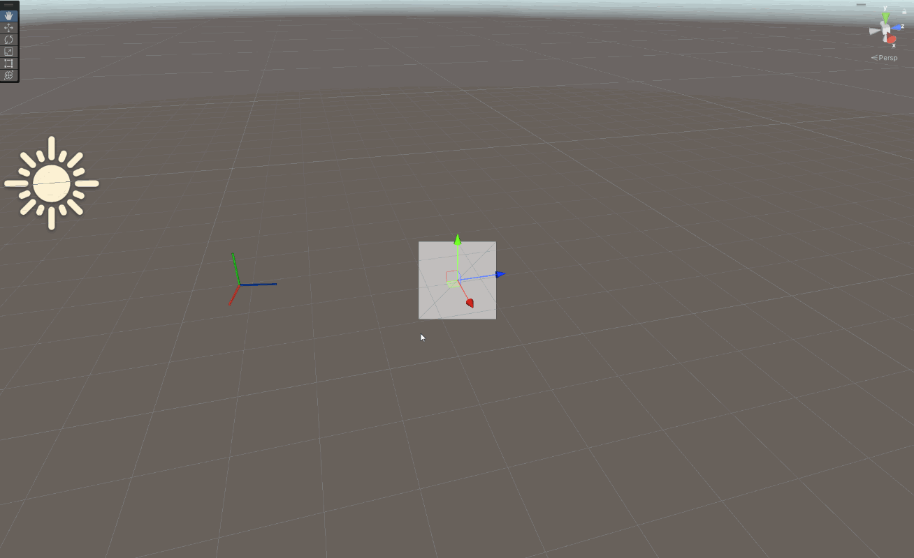
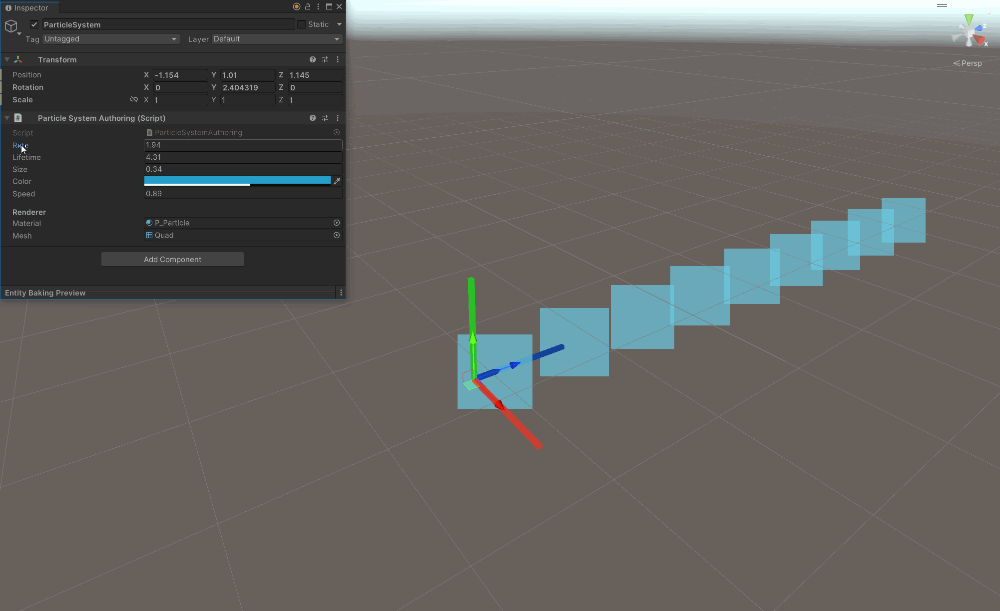
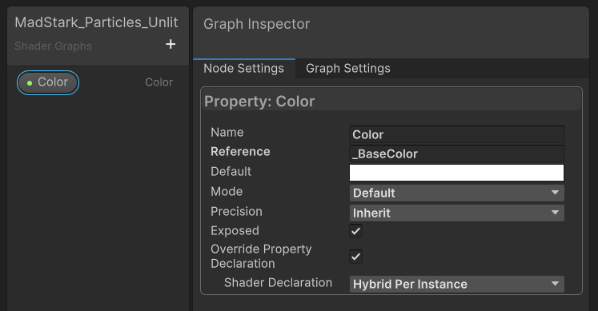
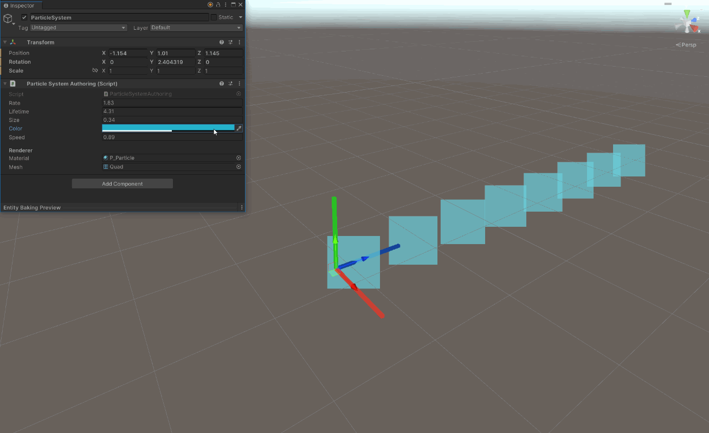

## Preamble

Unity has now release ECS 1.0, and while it's still not out of preview, it is supposed to be a lot more fleshed out. So I wanted to check it out for myself.

ECS is a very different architecture from what I'm used to with object-oriented programming. So this is also an exercice for me to get in the mindset of coding for ECS architectures.

To start with, I will recreate only a few properties from a traditional particle system, with the idea that I will add more over time.

In this article, I will explain how I made the following properties:
- Spawn rate
- Lifetime
- Size
- Color
- Speed
- Material
- Mesh

Here's what it looks like with those features:



Let's break it down.


## Spawning Particles


### Particle System Components

To define a system, I created 3 components, `ParticleSystemInfo`, `ParticleSystemData` and `ParticleSystemRenderData`.

`ParticleSystemInfo` is meant to change at runtime and describe the current state of the system.
<br>
`ParticleSystemData` is meant to be mostly read-only and contain all the particle configuration data.
<br>
I grouped them along with a `LocalToWorld` component into a `ParticleSystemAspect` for simpler iteration.

```csharp
public struct ParticleSystemInfo : IComponentData
{
    public double LastSpawnTime;
    public int ParticleCount; // Current number of living particles spawned by this system
    public int SpawnedCount; // Total count of particles spawned by this particle system since 
}

public struct ParticleSystemData : IComponentData
{
    public float Rate;
    public float Lifetime;
    public float Size;
    public float4 Color;
    public float Speed;
}
```


### Particles Components

Each particle should only have the components that are relevant for its update. However, all particles still have common components:

```csharp
public struct Particle : IComponentData
{
    public float Age;
    public float Lifetime;
    public float AgeOverLifetime;
}

public struct ParticleParent : ICleanupSharedComponentData
{
    public Entity Value;
}
```

`Particle` stores the basic info for this particle. `AgeOverLifetime` is the traditional 0 to 1 value used to animate some modifiers that change over time.

`ParticleParent` is a bit special. It is a `ICleanupSharedComponentData` meaning it will not be deleted when the particle is destroyed, giving a final opportunity for the developer to pickup the particle and execute some cleanup.
I will use this in order to update the `ParticleCount` of the system that spawned this particle after a particle is destroyed. Checkout the [clean-up section](#clean-up-entities) for a detailed explanation.


### Particle Spawning System

Then, I simply have a system `ParticleSpawningSystem` from which I set the lifetime, parent, scale, and initial position of the particles.

```csharp
protected override void OnUpdate()
{
    EntityCommandBuffer ecb = new EntityCommandBuffer(Allocator.Temp);
    
    double time = SystemAPI.Time.ElapsedTime;
    
    foreach ((ParticleSystemAspect system, Entity e) in SystemAPI.Query<ParticleSystemAspect>().WithEntityAccess())
    {
        if (system.Data.Rate == 0f)
            continue;
        
        float particlesPerSecond = 1 / system.Data.Rate;
        
        if (system.Info.LastSpawnTime == 0f || time - system.Info.LastSpawnTime >= particlesPerSecond)
        {
            Entity particle = ecb.CreateEntity();

            ecb.SetComponent(particle, new Particle {
                Lifetime = system.Data.Lifetime
            });
            
            ecb.SetSharedComponent(particle, new ParticleParent { Value = e });
            
            ecb.SetComponent(particle, new LocalTransform {
                Position = system.Transform.Position,
                Rotation = quaternion.identity,
                Scale = system.Data.Size
            });

            // Update system info
            system.Info.LastSpawnTime = time;
            system.Info.ParticleCount++;
            system.Info.SpawnedCount++;
        }
    }
    
    ecb.Playback(EntityManager);
    ecb.Dispose();
}
```

Here we have the particles spawning:




## Lifetime


### Destroy Entities

To managed the life of a particle, I created a `ParticleLifeSystem`. It will not only update the time on each particle, but also destroy them when they are passed their lifetime.

```csharp
protected override void OnUpdate()
{
    float dt = SystemAPI.Time.DeltaTime;

    EntityCommandBuffer ecb = new EntityCommandBuffer(Allocator.Temp);
    
    foreach ((RefRW<Particle> particle, Entity e) in SystemAPI.Query<RefRW<Particle>>().WithEntityAccess())
    {
        particle.ValueRW.Age += dt;
        particle.ValueRW.AgeOverLifetime = math.saturate(particle.ValueRW.Age / particle.ValueRW.Lifetime);

        if (particle.ValueRW.Age >= particle.ValueRW.Lifetime)
        {
            ecb.DestroyEntity(e);
        }
    }
    
    ecb.Playback(EntityManager);
    ecb.Dispose();
}
```

Even though I call `DestroyEntity` in the `ParticleLifeSystem`, as explained in the [Particles Components section](#particles-components), the `ParticleParent` component will keep the particle alive, but every other component will be removed. For properly removing the entity, I created another clean-up system.


### Clean-up Entities

I wanted to have the `ParticleSystemInfo.ParticleCount` store the current number of living particles spawned by this system. So I created the `ParticleCleanupSystem` to update it after a particle has been destroyed.
Here is what it does:

1. Iterate through all unique `ParticleParent`.
```csharp
EntityManager.GetAllUniqueSharedComponents(out NativeList<ParticleParent> particleParents, Allocator.Temp);
for (int i = 0; i < particleParents.Length; i++)
{
    //...
}
```

2. For each parent, query all entities that have a matching `ParticleParent` but no `Particle` (meaning they need to be cleaned-up).
```csharp
EntityQuery query = SystemAPI.QueryBuilder().WithAll<ParticleParent>().WithNone<Particle>().Build();
query.SetSharedComponentFilter(particleParents[i]);
```

3. Calculate how many particles we're about to delete.
```csharp
int count = query.CalculateEntityCount();
```

4. Finally allow the particle to be destroyed by removing the `ICleanupSharedComponentData`. I pass the query directly for increased performance, as the `count` is really the value I care about, I don't need to iterate through them all myself.
```csharp
ecb.RemoveComponent<ParticleParent>(query);
```

5. Update the `ParticleSystemInfo.ParticleCount` with how many entities we be destroyed this update.
```csharp
Entity spawnerEntity = particleParents[i].Value;
ParticleSystemInfo systemData = EntityManager.GetComponentData<ParticleSystemInfo>(spawnerEntity);
systemData.ParticleCount -= count;
ecb.SetComponent(spawnerEntity, systemData);
```

Once all put together, this is what the update loop looks like:

```csharp
protected override void OnUpdate()
{
    EntityCommandBuffer ecb = new EntityCommandBuffer(Allocator.Temp);

    EntityManager.GetAllUniqueSharedComponents(out NativeList<ParticleParent> particleParents, Allocator.Temp);

    for (int i = 0; i < particleParents.Length; i++)
    {
        EntityQuery query = SystemAPI.QueryBuilder().WithAll<ParticleParent>().WithNone<Particle>().Build();
        query.SetSharedComponentFilter(particleParents[i]);

        int count = query.CalculateEntityCount();
        
        ecb.RemoveComponent<ParticleParent>(query);

        if (count > 0)
        {
            Entity spawnerEntity = particleParents[i].Value;
            ParticleSystemInfo systemData = EntityManager.GetComponentData<ParticleSystemInfo>(spawnerEntity);
            systemData.ParticleCount -= count;
            ecb.SetComponent(spawnerEntity, systemData);
        }
    }

    particleParents.Dispose();

    ecb.Playback(EntityManager);
    ecb.Dispose();
}
```

The cool thing with doing this is that I can call `DestroyEntity` from any system, and it will clean-up the entity alright, each system don't have to handle also updating the `ParticleSystemInfo.ParticleCount`.


## Rendering

We have particles that spawn, let's take care of the rendering so we can visualise what we're doing from now on.
I wanted to have the possibility to set a custom mesh on the spawner but use a default quad mesh when it is set to null.

I learned doing this experiment that rendering an entity in pure ECS, without using the GameObject conversion workflow is really hard! I'm not even sure I got it right here. I need to investigate more.

I needed to add a bunch of components to my entity. Namingly `MaterialMeshInfo`, `WorldToLocal_Tag`, `RenderBounds`, `RenderFilterSettings`, `RenderMeshArray` and `WorldRenderBounds`.

In my `ParticleSpawningSystem` I add an `OnCreate` method where I initialize the properties that won't change.

```csharp
protected override void OnCreate()
{
    m_QuadMesh = new Mesh();
    m_QuadMesh.SetVertices(new [] {
        new Vector3(-0.5f, -0.5f, 0f),
        new Vector3(-0.5f, 0.5f, 0f),
        new Vector3(0.5f, 0.5f, 0f),
        new Vector3(0.5f, -0.5f, 0f)
    });
    m_QuadMesh.SetTriangles(new []{ 0, 1, 2, 2, 3, 0 }, 0);
    m_QuadMesh.RecalculateNormals();
    m_QuadMesh.RecalculateTangents();
    m_QuadMesh.RecalculateBounds();

    m_QuadBounds = new RenderBounds { Value = m_QuadMesh.bounds.ToAABB() };

    m_Material = new Material(Shader.Find("Universal Render Pipeline/Unlit"));
}
```

I created a method to setup the rendering on a given entity.

```csharp
private void SetupRenderer(ref EntityCommandBuffer ecb, ref Entity entity)
{
    ecb.AddComponent<WorldToLocal_Tag>(entity);
    ecb.AddComponent<WorldRenderBounds>(entity);

    ecb.SetSharedComponent(entity, new RenderFilterSettings {
        ShadowCastingMode = ShadowCastingMode.On,
        Layer = 0,
        MotionMode = MotionVectorGenerationMode.Object,
        ReceiveShadows = true,
        RenderingLayerMask = 1,
        StaticShadowCaster = false
    });
    
    ecb.SetSharedComponentManaged(entity, new RenderMeshArray(new[] { m_Material }, new[] { m_QuadMesh }));
    ecb.SetComponent(entity, MaterialMeshInfo.FromRenderMeshArrayIndices(0, 0));
    ecb.SetComponent(entity, m_QuadBounds);
}
```




## Velocity

In order to have the particles move, I introduced the `ParticleVelocity` component.

```csharp
public struct ParticleVelocity : IComponentData
{
    public float3 Value;
}
```

Which I initialize in the `ParticleSpawningSystem` as the system's forward vector multiplied by the speed.

```csharp
float3 velocity = system.Transform.Forward * system.Data.Speed;
ecb.SetComponent(particle, new ParticleVelocity {Value = velocity});
```

Then, in order to update the position of the particles, I introduced a `ParticleVelocitySystem`. I simply iterate through all the particles with a `ParticleVelocity` component and modify the position.

```csharp
[UpdateBefore(typeof(TransformSystemGroup))]
public partial class ParticleVelocitySystem : SystemBase
{
    protected override void OnUpdate()
    {
        float dt = SystemAPI.Time.DeltaTime;
        
        foreach ((RefRO<ParticleVelocity> velocity, RefRW<LocalTransform> localTransform) in SystemAPI.Query<RefRO<ParticleVelocity>, RefRW<LocalTransform>>())
        {
            float3 translate = velocity.ValueRO.Value * dt;
            localTransform.ValueRW.Position += translate;
        }
    }
}
```




## Improved Rendering

In order to have the particles look a bit better, I want to add three features. Billboarding, custom mesh and material, and customisable particle colour.


### Billboard Shader

To achieve the billboarding, I decided to use a custom shader and therefore material for the particles. Here is the shader graph:



Here's what the shader looks like applied to a default Unity quad:




### Custom Mesh and Material

To apply the custom material to the particles, I need to store a reference to my material. I decided to introduce a third component on my system, the `ParticleSystemRenderData`.
As it stores a reference to managed types, I needed to make it an `ISharedComponentData`.
I also added an optional `OverrideMesh` field to support custom meshes instead of a quad.

```csharp
public struct ParticleSystemRenderData : ISharedComponentData, IEquatable<ParticleSystemRenderData>
{
    private int m_Hash;
    
    public Material Material;

    public Mesh OverrideMesh;


    public ParticleSystemRenderData(Material material, Mesh mesh)
    {
        Material = material;
        OverrideMesh = mesh;
        m_Hash = 0;
        RecalculateHash();
    }

    public void RecalculateHash()
    {
        m_Hash = HashCode.Combine(Material, OverrideMesh);
    }

    public bool Equals(ParticleSystemRenderData other)
    {
        return other.m_Hash == m_Hash;
    }

    public override bool Equals(object obj)
    {
        return obj is ParticleSystemRenderData other && Equals(other);
    }

    public override int GetHashCode()
    {
        return m_Hash;
    }
}
```

In my `ParticleSpawningSystem` I can use those to setup the new particle:

```csharp
private void SetupRenderer(ref EntityCommandBuffer ecb, ref Entity entity, in ParticleSystemRenderData systemRenderData)
{
    //...
    
    Mesh mesh = systemRenderData.OverrideMesh == null ? m_QuadMesh : systemRenderData.OverrideMesh;
    Material material = systemRenderData.Material;
    ecb.SetSharedComponentManaged(entity, new RenderMeshArray(new[] { material }, new[] { mesh }));
    
    //...
}
```

Beatiful!




### Colour

In my custom shader, I make sure to name my colour property `_BaseColor`, and the `Override Property Declaration` set to `Hybrid Per Instance`.



Then, I can leverage the `URPMaterialPropertyBaseColor` component, which comes out of the box with the entities rendering package.

```csharp
ecb.SetComponent(particle, new URPMaterialPropertyBaseColor {
    Value = system.Data.Color
});
```

This component has a `MaterialProperty` tag set to `"_BaseColor"`.

```csharp
// Decompiled code

[MaterialProperty("_BaseColor", -1)]
public struct URPMaterialPropertyBaseColor : IComponentData, IQueryTypeParameter
{
    public float4 Value;
}
```

This is a feature of the Unity entities rendering package, which will apply the value of the component on the material automatically.




## Conclusion

This was a ton of fun! It's still very primitive, so I am planning on improving it over time and add more features.

What I want to do next
- Effects over lifetime (velocity, colour over time)
- Random between two constants
- Spawn area shape
- Baking the Unity particle system
- Parallelise where possible using the Unity Job System


